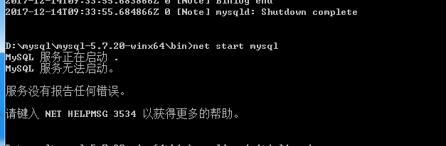
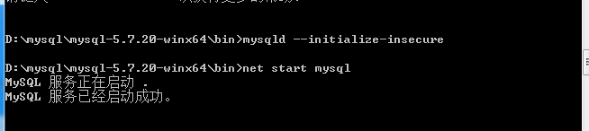
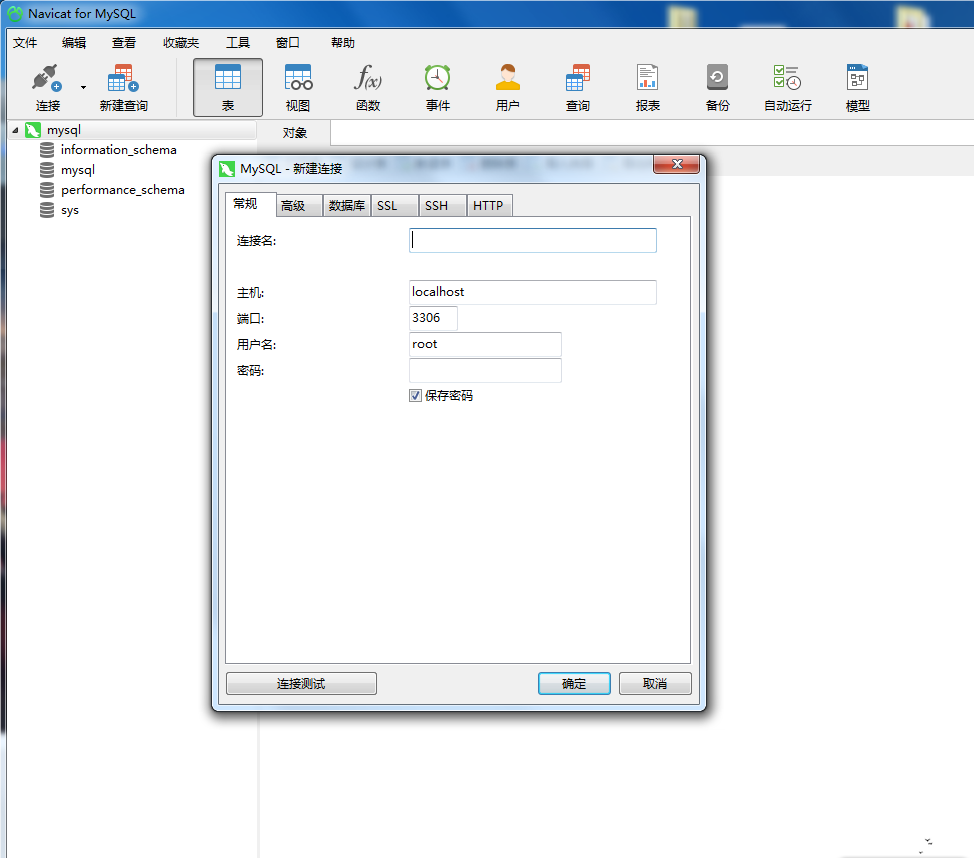

## MySQL的安装

### 安装方式

>  专用的软件包管理器
>
>  * deb: 
>  * rpm: (Oracle linux) ,Centos, Centos
>
>  通用二进制格式包
>
>  * gcc:(x86,x64)
>  * icc
>
>  源代码包:
>
>  * 5.5 ,5.6 (cmake)

### 编译安装

> * cmake-x-x-x.tar.gz 
> * mysql-x-x-x.tar.gz
> * 环境:centos7 x64
>
> ```bash
> [root@localhost ~]# mkdir software
> [root@localhost ~]# cp /home/kning/learn_Cent/*.tar.gz ./software/
> [root@localhost ~]# cd software/
> [root@localhost software]# ls 
> cmake-2.8.8.tar.gz  mysql-5.5.32.tar.gz
> [root@localhost software]# ls -la 
> 总用量 29584
> drwxr-xr-x.  2 root root       59 12月 14 05:37 .
> dr-xr-x---. 10 root root     4096 12月 14 05:37 ..
> -rw-r--r--.  1 root root  5691656 12月 14 05:37 cmake-2.8.8.tar.gz
> -rw-r--r--.  1 root root 24596474 12月 14 05:37 mysql-5.5.32.tar.gz
> [root@localhost software]# chmod 777 *.tar.gz
> [root@localhost software]# ll 
> 总用量 29580
> -rwxrwxrwx. 1 root root  5691656 12月 14 05:37 cmake-2.8.8.tar.gz
> -rwxrwxrwx. 1 root root 24596474 12月 14 05:37 mysql-5.5.32.tar.gz
> ```
>
> #### 安装`cmake`
>
> ```bash
> tar xf cmake-2.8.8.tar.gz
> cd cmake-2.8.8
> ./bootstrap
> make 
> make install
> ```
>
> #### 编译安装mysql
>
> 使用cmake编译mysql-5.5
> cmake指定编译选项的方式不同于make，其实现方式对比如下：
>
> ```mysql
> ./configure           cmake .
> ./configure --help    cmake . -LH or ccmake .
> ```
>
> 指定安装文件的安装路径时常用的选项：
>
> ```mysql
> -DCMAKE_INSTALL_PREFIX=/usr/local/mysql
> -DMYSQL_DATADIR=/data/mysql
> -DSYSCONFDIR=/etc
> -DCMAKE_INSTALL_PREFIX=/usr/local/mysql
> -DMYSQL_DATADIR=/data/mysql
> -DSYSCONFDIR=/etc
> ```
>
> 默认编译的存储引擎包括：csv、myisam、myisammrg和heap。若要安装其它存储引擎，可以使用类似如下编译选项：
>
> ```mysql
> -DWITH_INNOBASE_STORAGE_ENGINE=1
> -DWITH_ARCHIVE_STORAGE_ENGINE=1
> -DWITH_BLACKHOLE_STORAGE_ENGINE=1
> -DWITH_FEDERATED_STORAGE_ENGINE=1
> ```
>
> 若要明确指定不编译某存储引擎，可以使用类似如下的选项：
>
> ```mysql
> -DWITHOUT<ENGINE>STORAGE_ENGINE=1
> 比如：
> -DWITHOUT_EXAMPLE_STORAGE_ENGINE=1
> -DWITHOUT_FEDERATED_STORAGE_ENGINE=1
> -DWITHOUT_PARTITION_STORAGE_ENGINE=1
> ```
>
> 如若要编译进其它功能，如SSL等，则可使用类似如下选项来实现编译时使用某库或不使用某库：
>
> ```mysql
> -DWITH_READLINE=1
> -DWITH_SSL=system
> -DWITH_ZLIB=system
> -DWITH_LIBWRAP=0
> ```
>
> 其它常用的选项：
>
> ```mysql
> -DMYSQL_TCP_PORT=3306
> -DMYSQL_UNIX_ADDR=/tmp/mysql.sock
> -DENABLED_LOCAL_INFILE=1
> -DEXTRA_CHARSETS=all
> -DDEFAULT_CHARSET=utf8
> -DDEFAULT_COLLATION=utf8_general_ci
> -DWITH_DEBUG=0
> -DENABLE_PROFILING=1
> ```
>
> 编译安装
>
> ```bash
> groupadd -r mysql
> useradd -g mysql -r -d /data/mydata mysql
> tar xf mysql-5.5.25a.tar.gz 
> cd mysql-5.5.25a
> cmake . -DCMAKE_INSTALL_PREFIX=/usr/local/mysql \
>           -DMYSQL_DATADIR=/mydata/data \
>           -DSYSCONFDIR=/etc \
> 		  -DWITH_INNOBASE_STORAGE_ENGINE=1 \
>           -DWITH_ARCHIVE_STORAGE_ENGINE=1 \
>           -DWITH_BLACKHOLE_STORAGE_ENGINE=1 \
> 		  -DWITH_READLINE=1 \
> 		  -DWITH_SSL=system \
> 		  -DWITH_ZLIB=system \
> 		  -DWITH_LIBWRAP=0 \
> 		  -DMYSQL_UNIX_ADDR=/tmp/mysql.sock \
> 		  -DDEFAULT_CHARSET=utf8 \
>           -DDEFAULT_COLLATION=utf8_general_ci
> make 
> make install
> ```

###` Win7` 安装

> 1.准备工作
>
> 在网页http://dev.mysql.com/downloads/mysql/下载Windows (x86, 64-bit), ZIP Archive版本；解压到自己想安装的文件夹，这里的解压文件为`D:\mysql\mysql\mysql-5.7.20-winx64`
>
> 2.安装启动`mysql`
>
> 以管理员身份打开cmd这里一定是管理员身份cd到解压的文件目录下`D:\mysql\mysql-5.7.20-winx64\bin`输入 mysqld install 出现安装成功就安装好了
> 然后输入 net start mysql 发现无法启动
>
> 需要在bin目录下初始化用户
>
> ```bash
> mysqld --initialize-insecure
> ```
>
> 自动生成无密码的root用户
> 初始化后再启动mysql 正常启动
>
> 
>
> 默认安装好的`root` 账户是没有密码的,设置`root` 的默认账户
>
> ```mysql
> D:\mysql\mysql-5.7.20-winx64\bin>mysql -u root
> Welcome to the MySQL monitor.  Commands end with ; or \g.
> Your MySQL connection id is 3
> Server version: 5.7.20 MySQL Community Server (GPL)
>
> Copyright (c) 2000, 2017, Oracle and/or its affiliates. All rights reserved.
>
> Oracle is a registered trademark of Oracle Corporation and/or its
> affiliates. Other names may be trademarks of their respective
> owners.
>
> Type 'help;' or '\h' for help. Type '\c' to clear the current input statement.
>
> mysql> SET PASSWORD FOR 'root'@'localhost'=PASSWORD('2008.Cn123');
> Query OK, 0 rows affected, 1 warning (0.00 sec)
>
> mysql> FLUSH PRIVILEGES;
> Query OK, 0 rows affected (0.00 sec)
>
> mysql> quit;
> Bye
> ```
>
> 设置好后,可以使用`root` 登陆
>
> 3.设置默认字符串
>
> 查看支持的字符串
>
> ```sql
> D:\mysql\mysql-5.7.20-winx64\bin>mysql -u root -p
> Enter password: **********
> Welcome to the MySQL monitor.  Commands end with ; or \g.
> Your MySQL connection id is 7
> Server version: 5.7.20 MySQL Community Server (GPL)
>
> Copyright (c) 2000, 2017, Oracle and/or its affiliates. All rights reserved.
>
> Oracle is a registered trademark of Oracle Corporation and/or its
> affiliates. Other names may be trademarks of their respective
> owners.
>
> Type 'help;' or '\h' for help. Type '\c' to clear the current input statement.
>
> mysql> show variables like 'collation_%';
> +----------------------+-------------------+
> | Variable_name        | Value             |
> +----------------------+-------------------+
> | collation_connection | gbk_chinese_ci    |
> | collation_database   | latin1_swedish_ci |
> | collation_server     | latin1_swedish_ci |
> +----------------------+-------------------+
> 3 rows in set, 1 warning (0.00 sec)
>
> mysql> show variables like 'character_set_%';
> +--------------------------+----------------------------------------------+
> | Variable_name            | Value                                        |
> +--------------------------+----------------------------------------------+
> | character_set_client     | gbk                                          |
> | character_set_connection | gbk                                          |
> | character_set_database   | latin1                                       |
> | character_set_filesystem | binary                                       |
> | character_set_results    | gbk                                          |
> | character_set_server     | latin1                                       |
> | character_set_system     | utf8                                         |
> | character_sets_dir       | D:\mysql\mysql-5.7.20-winx64\share\charsets\ |
> +--------------------------+----------------------------------------------+
> 8 rows in set, 1 warning (0.00 sec)
>
> mysql> quit;
> Bye
> ```
>
> 关闭服务
>
> ```sql
> D:\mysql\mysql-5.7.20-winx64\bin>net stop mysql
> MySQL 服务正在停止.
> MySQL 服务已成功停止。
> ```
>
> 修改默认的配置文件`my.ini`,windowns 下默认没有这个文件,可以自己创建.
>
> ```sql
> [client]
>
> port=3306
>
> default-character-set=utf8
>
> [mysqld]
>
> basedir=D:\mysql\mysql-5.7.20-winx64
>
> datadir=D:\mysql\mysql-5.7.20-winx64\data
>
> character-set-server=utf8
>
> [mysql]
>
> default-character-set=utf8
> ```
>
> 重启启动服务,并查看字符串
>
> ```sql
> D:\mysql\mysql-5.7.20-winx64\bin>net stop mysql
> MySQL 服务正在停止.
> MySQL 服务已成功停止。
>
>
> D:\mysql\mysql-5.7.20-winx64\bin>net start mysql
> MySQL 服务正在启动 .
> MySQL 服务已经启动成功。
>
>
> D:\mysql\mysql-5.7.20-winx64\bin>mysql -u root -p
> Enter password: **********
> Welcome to the MySQL monitor.  Commands end with ; or \g.
> Your MySQL connection id is 3
> Server version: 5.7.20 MySQL Community Server (GPL)
>
> Copyright (c) 2000, 2017, Oracle and/or its affiliates. All rights reserved.
>
> Oracle is a registered trademark of Oracle Corporation and/or its
> affiliates. Other names may be trademarks of their respective
> owners.
>
> Type 'help;' or '\h' for help. Type '\c' to clear the current input statement.
>
> mysql> show variables like 'collation_%';
> +----------------------+-----------------+
> | Variable_name        | Value           |
> +----------------------+-----------------+
> | collation_connection | utf8_general_ci |
> | collation_database   | utf8_general_ci |
> | collation_server     | utf8_general_ci |
> +----------------------+-----------------+
> 3 rows in set, 1 warning (0.00 sec)
>
> mysql> show variables like 'character_set_%';
> +--------------------------+----------------------------------------------+
> | Variable_name            | Value                                        |
> +--------------------------+----------------------------------------------+
> | character_set_client     | utf8                                         |
> | character_set_connection | utf8                                         |
> | character_set_database   | utf8                                         |
> | character_set_filesystem | binary                                       |
> | character_set_results    | utf8                                         |
> | character_set_server     | utf8                                         |
> | character_set_system     | utf8                                         |
> | character_sets_dir       | D:\mysql\mysql-5.7.20-winx64\share\charsets\ |
> +--------------------------+----------------------------------------------+
> 8 rows in set, 1 warning (0.00 sec)
>
> mysql> quit;
> Bye
> ```
>
> #### Ubuntu 下修改配置文件`/etc/mysql/my.cnf`
>
> ```mysql
> [client]  
> default-character-set=utf8  
>
> [mysql]
> default-character-set=utf8
>
> [mysqld]
> default-storage-engine=INNODB  
> character-set-server=utf8  
> collation-server=utf8_general_ci 
> ```
>
> 
>
> 4.使用客户端连接(Navicat for MySQL)
>
> 
>
> 5.开启远程连接
>
> 首先确保本机的 `MySQL` 是启动状态，然后打开终端，输入以下命令连接到 `MySQL` ，需要输入一下本机 `MySQL` 的连接密码 
>
> ```sql
> mysql -u root -p
> ```
>
> 输入以下命令选择要使用的数据库，修改远程连接的基本信息，保存在 `mysql` 数据库中，因此使用 `mysql` 数据库。
>
> ```mysql
> use mysql;
> ```
>
> 输入以下命令来更改远程连接的设置，前面的 `root` 表示别人访问本机 `MySQL` 的用户名，后面的 `root` 表示别人访问本机 `MySQL` 的密码
>
> ```mysql
> GRANT ALL PRIVILEGES ON *.* TO 'root'@'%' IDENTIFIED BY 'root' WITH GRANT OPTION;
> ```
>
> 输入以下命令来刷新刚才修改的权限，使其生效
>
> ```mysql
> flush privileges;
> ```
>
> 输入以下命令来查看修改是否成功，如果出现一行 `host = %` ，`user = root` 就表示修改成功。
>
> ```mysql
> select host,user from user;
> ```
>
> 到此就修改成功了，`MySQL` 远程连接已经开启，其他人就可以通过 `IP` 地址来连接本机的 `MySQL` 数据库了。

### 一个基于命令行的mysql 补全工具

> [项目地址](http://www.mycli.net/)
>
> 安装(python环境)
>
> ```bash
> $ pip install mycli
> ```
>
> 命令帮助
>
> ```bash
> $ mycli --help
> Usage: mycli [OPTIONS] [DATABASE]
>
>   A MySQL terminal client with auto-completion and syntax highlighting.
>
>   Examples:
>     - mycli my_database
>     - mycli -u my_user -h my_host.com my_database
>     - mycli mysql://my_user@my_host.com:3306/my_database
>
> Options:
>   -h, --host TEXT               Host address of the database.
>   -P, --port INTEGER            Port number to use for connection. Honors
>                                 $MYSQL_TCP_PORT.
>   -u, --user TEXT               User name to connect to the database.
>   -S, --socket TEXT             The socket file to use for connection.
>   -p, --password TEXT           Password to connect to the database.
>   --pass TEXT                   Password to connect to the database.
>   --ssl-ca PATH                 CA file in PEM format.
>   --ssl-capath TEXT             CA directory.
>   --ssl-cert PATH               X509 cert in PEM format.
>   --ssl-key PATH                X509 key in PEM format.
>   --ssl-cipher TEXT             SSL cipher to use.
>   --ssl-verify-server-cert      Verify server's "Common Name" in its cert
>                                 against hostname used when connecting. This
>                                 option is disabled by default.
>   -v, --version                 Output mycli's version.
>   -D, --database TEXT           Database to use.
>   -R, --prompt TEXT             Prompt format (Default: "\t \u@\h:\d> ").
>   -l, --logfile FILENAME        Log every query and its results to a file.
>   --defaults-group-suffix TEXT  Read MySQL config groups with the specified
>                                 suffix.
>   --defaults-file PATH          Only read MySQL options from the given file.
>   --myclirc PATH                Location of myclirc file.
>   --auto-vertical-output        Automatically switch to vertical output mode
>                                 if the result is wider than the terminal
>                                 width.
>   -t, --table                   Display batch output in table format.
>   --csv                         Display batch output in CSV format.
>   --warn / --no-warn            Warn before running a destructive query.
>   --local-infile BOOLEAN        Enable/disable LOAD DATA LOCAL INFILE.
>   --login-path TEXT             Read this path from the login file.
>   -e, --execute TEXT            Execute command and quit.
>   --help                        Show this message and exit.
> ```
>
>
> 运行
> ```bash
> ningyanke@NYKpython:~/python3_learn/SQL/book_sql$ mycli -u root -p  "2008.Cn123"
> ```

