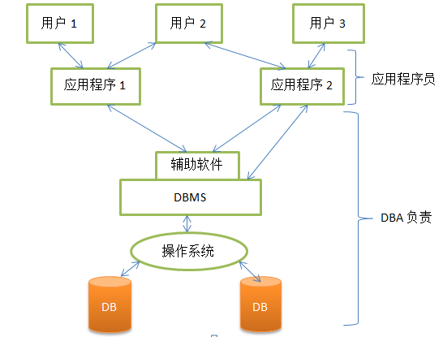

## 1.1 数据库系统概述

#### 目的: 了解基本知识,初步掌握概念

### 1.1.1 数据库的4个基本概念(掌握)

> #### 1.数据(Data)
>
> 数据(data): 是数据库中存储的基本对象
>
> 数据的定义: 描述事物的**符号记录**
>
> 数据的种类: 数字,文字,图片,图像等
>
> 数据的含义被称为数据的语义,数据与其语义是不可分的: 
>
> ```mysql
> 91
> 语义1: 学生某门功课的成绩
> 语义2: 某学生的体重
> ```
>
> 数据是有结构的: 记录是计算机存储数据的一种格式或一种方法
>
> #### 2.数据库(Database,DB)
>
> 数据库(database): 是长期存储在计算机上内,有组织的,可共享的大量数据的集合
>
> 为什么要建立数据库: 收集并抽取一个应用所需要的大量数据,将其保持,以供进一步加工
>
> 数据库的基本特征
>
> * 数据按一定的数据模型组织,描述和存储
> * 可以为各种用户共享,冗余度较小,易扩展
> * 数据的独立性高
>
> #### 3.数据库管理系统(Database Management System,DBMS).
>
> 什么是数据库管理系统:
>
> * 位于用户应用和操作系统之间的一层数据管理软件
> * 是基础软件,是一个大型复杂的软件系统
>
> 数据库管理系统的用途
>
> * 科学的组织和存储数据,高效的获取和维护数据
>
> 数据库管理系统的主要功能:
>
> * 1.数据定义功能
>   * 提供数据定义语言(DDL)
>   * 定义数据库中的数据对象
> * 2.数据组织,存储和管理
>   * 分类组织,存储和管理各种数据
>   * 确定数据在存储级别上的结构和存取方式
>   * 实现数据之间的联系
>   * 提供多种存取方法提高存取效率
> * 3.数据操纵功能
>   * 提供数据操纵语言(DML)
>   * 实现对数据库的基本操作(查询,插入,删除,和修改)
> * 4.数据库的事物管理和运行管理
>   * 数据的安全性,完整性,多用户对数据的并发使用
>   * 发生故障后的系统恢复数据
> * 5.数据库的建立和维护功能
>   * 提供实用程序/工具,完成数据库数据批量转载,数据库转存储,介质故障恢复,数据库的重新组织和性能监视等
> * 6.其他功能
>   * 数据库管理系统与网络中其他软件系统的通信
>   * 数据库管理系统系统之间的数据转换
>   * 异构数据库之间的互相访问和操作
>
> #### 4.数据库系统
>
> 数据库系统(DBS):
>
> * 是指计算机系统中引入数据库后的系统架构
>
> 数据库系统的构成:
>
> * 数据库
> * 数据库管理系统(及应用开发工具)
> * 应用程序
> * 数据库管理员(DBA)
>
> +

### 1.1.2 数据库管理技术的产生和发展(了解)

> * 人工管理阶段
> * 文件系统阶段
> * 数据库系统阶段

### 1.1.3 数据库系统的特点(了解)

> 数据结构化
>
> 数据的共享性高,冗余度低并且易扩展
>
> 数据独立性高
>
> 数据由数据库管理系统同意管理和控制

