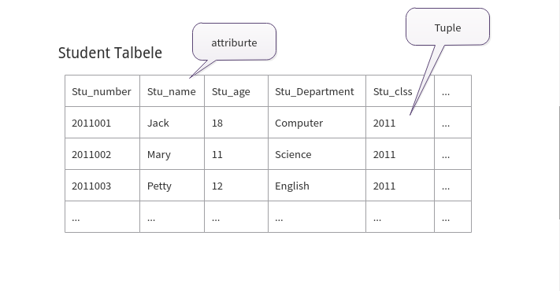

## 1.2 数据模型

------

目的: 掌握概念模型的基本概念,数据模型的3个组成要素,关系数据模型的相关概念

------

> 数据模型是对现实世界的数据特征的抽象
>
> 通俗的讲,数据模型就是现实世界的模型
>
> 数据模型要满足三个方面的要求
>
> * 能比较真实的模拟世界
> * 容易被人理解
> * 便于在计算机上实现
>
>

### 1.2.1 两大数据模型

> 数据模型分为2类
>
> * 概念模型,也称为信息模型
>   * 它是按照用户的观点来对数据和信息建模,用于数据库设计.
> * 逻辑模型和物理模型
>   * 逻辑模型主要包括网状模型,层次模型,关系模型,面向对象数据模型,对象关系模型,对象关系数据模型,半结构化数据模型
>   * 按照计算机系统的观点对数据建模,用于DMBS的实现
>   * 物理模型是对数据最底层的抽象

### 1.2.2 概念模型

> 概念模型的用途
>
> * 概念模型用于对现实世界建模
> * 是现实世界到机器世界的一个中间层次
> * 是数据库设计的有力工具
> * 数据库设计人员和用户中间进行交流的语言
>
> 对数据模型的基本要求
>
> * 较强的语义表达
> * 简单,清晰,易于用户理解
>
> 信息世界中的基本概念
>
> * 实体(Entity)
>   * 客观存在并可以相互区别的事物称为实体
> * 属性(Attitute)
>   * 实体所居有的某一个特性被称呼为属性
> * 码(Key)
>   * 唯一表示实体的属性集 被称为码
> * 实体型(Entity Type)
>   * 用实体名及属性名集合来抽象和刻画同类实体称为实体型
>   * 例如，学生（学号，姓名，性别，出生年月，所在院系，入学时间）就是一个实体型
> * 实体集(Entity Set)
>   * 同一类型实体的集合被称为实体集
> * 联系(Relationship)
>   * 显示世界中事物内部以及事物之间的联系.在信息世界中反应为实体型内部的联系和实体型之间的联系.
>   * 实体之间的联系,指的是实体之间各个属性之间的联系
>   * 实体之间的联系, 通常是值不同实体集之间的联系
>   * 实体之间的联系有,1对多,多对1,和多对多 等多种类型
>
> 概念模型的一种表示方法:
>
> * 实体-联系方法(Entity-Relationship Approach)
>   * 用E-R图来描述现实世界的概念模型
>   * E-R 方法也称为E-R模型

### 1.2.3 数据模型的组成要素

> 数据模型是严格定义的一组概念的集合
>
> 数据模型由三部分组成
>
> * 1.数据结构--描述系统的静态特性
> * 2.数据操作--描述系统的动态特性
> * 3.完整性约束
>
> 刻画数据模型性质的重要方面
>
> * 用数据结构的类型来命名数据模型
>   * 层次结构-层次模型,网状结构-网状模型,关系结构-关系模型
> * 描述数据库的组成对象--对象的类型,内容,性质
> * 描述对象之间的联系
>
> 数据操作
>
> * 对数据库中各种对象的实例允许执行的操作的集合
> * 包括操作及有关的操作规则
>
> 数据操作的类型
>
> * 查询,更新,插入,删除,修改
>
> 数据操作语言
>
> * 定义数据操作的确切含义,符号,优先级别
> * 实现数据操作的语言
>   * 查询语言
>   * 更新语言
>
> 一组完整性规则的集合
>
> * 完整性规则:给定的数据模型中数据及其联系所具有的制约和依存规则
> * 用以限定符合数据模型的数据库状态以及状态的变化,以保证数据的正确,有效,相融
>
> 数据模型对完整性约束条件的定义
>
> * 遵守基本的通用的完整性约束条件
> * 提供定义完整性约束条件的机制,以反应具体应用说设计的数据必须遵守的特定的语义约束条件

### 1.2.4 最常用的数据模型

> * 层次模型
> * 网状模型
> * 关系模型
> * 面向对象数据模型
> * 对象关系数据模型
> * 半结构化数据模型--xml
> * 非机构化数据模型,图模型

### 1.2.5层次模型

> 层次模型用树形结构来表示各类实体以及时间间的联系

### 1.2.6 网状模型

### 1.2.7关系模型

#### 1.关系模型的数据结构

> 1.在用户的观点下,关系模型中数据的逻辑结构是一张二维表
>
> 
>
> 关系模型的常用术语及 **形象理解**
>
> * 关系(Relation): 一个关系对应通常来说是一张表
>
> * 元组(Tuple): 表中的一行即为一个元组
>
> * 属性(Attribute):表中的一列即为一个属性,给每一个属性起一个名字,即属性名
>
> * 主码(Key): 键, 表中的某个**属性组** ,它可以唯一确定一个元组
>
> * 域(Domain):一组具有相同数据类型的值的集合,属性的取值来自于某个域
>
>   * 比如:年龄域(0-120),性别域(男,女)
>
> * 分量: 元组中的一个属性值
>
> * 关系模式: 对**关系(Relation)**的描述
>
>   * | 关系名  | 属性1  | 属性２  | ...  | 属性n  |
>     | ---- | ---- | ---- | ---- | ---- |
>     | 学生   | 姓名   | 年龄   | ...  | 年级   |
>
> 2.关系必须是规范化的,满足一定的规范条件
>
> * 最基本的规范条件:**关系** 的每一个**分量** 必须是一个不可分的数据项,不允许表中还有表
>
> 3.术语对比
>
> | 关系术语  | 一般表格的术语     |
> | ----- | ----------- |
> | 关系名   | 表名          |
> | 关系模式  | 表头(表格的描述)   |
> | 关系    | 一张二维表       |
> | 元组    | 行           |
> | 属性    | 列           |
> | 属性名   | 列名          |
> | 属性值   | 列值          |
> | 分量    | 一行中一列中的交界点值 |
> | 非规范关系 | 表中有表        |

#### 2.关系模型的操纵与完整性约束

> 数据操作是集合操作,操作对象和操作结果都是 **关系**(表)
>
> * 查询
> * 插入
> * 删除
> * 更新
>
> 存取路径对用户隐蔽,用户只要指出"找什么",不必详细说明"怎么找"
>
> * 提高了数据的完整性,提高了用户的生产律
>
> 关系的完整性约束条件
>
> * 实体完整性
> * 参照完整性
> * 用户定义的完整性
>
> 优点:
>
> * 建立在严格的数学概念的基础上
> * 概念单一
>   * 实体和各类联系都是关系(表)
>   * 对数据的检索结构也是关系(表)
> * 关系模型的存取路径对用户透明
>   * 更高的数据独立性,更好的安全保密性
>
> 缺点
>
> * 存取路径对用户透明,查询效率不如格式化数据模型
> * 为提高性能,必须优化查询请求

