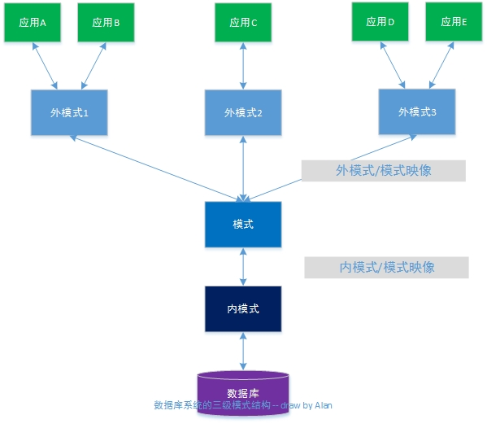

## 1.3数据库系统的结构

-------

> 从数据库应用人员的角度来看,数据库采用**三级模式** 结构,是数据库系统内部的系统结构
>
> 从数据库最终用户来看,数据库系统的结构有:
>
> * 单用户结构
> * 主动式结构
> * 分布式结构
> * 客户-服务器
> * 浏览器-应用服务器/数据库服务器
> * 等等

### 1.3.1 数据库系统的模式的概念

> 模式(schema)
>
> * 是对数据库逻辑结构和特征的描述
> * 是型的描述,不涉及具体值
> * 模式是相对稳定的
>
> 实例(Instance)
>
> * 数据库某一时刻的状态-模式的一个具体值
> * 用一个模式可以有很多实例
> * 实例随数据库中的数据的更新而变动
>
> "学生选课数据库"模式: 学生,课程和学生选课3个关系模式:
>
> * 学生表:Student(Sno,Sname,Ssex,Sage,Sdept)
> * 课程表:Course(Cno,Cname,Cpno,Credit)
> * 学生选课表:SC(Sno,Cno,Grade)
>
> 2014的学生选课数据库实例
>
> 2013的学生选课数据库实例
>
> 学生选课数据库模式对应了2个不同的实例

### 1.3.2 数据库系统的三级模式结构

> 
>
> 1.模式(Schema)
>
> 模式(逻辑模式)
>
> * 数据库中全体数据的逻辑结构和特征的描述
> * 所有用户的公共数据视图
>
> 一般,某个应用的数据库 有一个模式
>
> 模式是数据库系统模式结构的中心
>
> * 与数据的物理存储细节和硬件环境无关
> * 与具体的应用程序,开发工具及高级程序设计语言无关
>
> 定义模式
>
> * DDL定义数据的逻辑结构,以某种数据模型为基础.数据记录由哪些数据项构成,数据项的名字,类型,取值范围等
> * 定义数据之间的联系
> * 定义与数据有关的安全性,完整性要求
>
> 2.外模式(External Schema)
>
> 外模式(也称子模式或用户模式)
>
> * 数据库用户使用的局部数据的 逻辑结构和特征的描述
> * 数据库用户的数据视图,是与某一应用有关的数据的逻辑表示
>
> 外模式与模式的关系
>
> * 外模式通常是模式的子集,一个模式可以有多个外模式,反映了不同的用户的应用需求,看待数据的方式,对数据保密的要求
> * 对模式中某一数据,在不同的外模式中结构,类型,长度,保密级别等都可以不同
>
> 外模式与应用的关系
>
> * 一个外模式可以为多个应用系统所使用,一个应用程序只能使用一个外模式
>
> 外模式的用途
>
> * 每个用户只能看见和访问说对应的外模式中的数据,简化用户视图
> * 保证数据库安全性的一个有力措施
>
> 3.内模式(Internal Schema)
>
> 内模式(也称存储模式)
>
> * 是数据物理结构和存储方式的描述
> * 是数据在数据库内部的表示方式
>   * 记录的存储方式(例如:顺序存储,堆存储,cluste按hash方法存储等)
>   * 索引的组织方式(B+树,Bitmap,Hash)
>   * 数据是否压缩存储
>   * 数据是否加密
>   * 数据存储纪律结构的规定-如定长/变长,记录是否可以跨页存放等
> * 数据只有一个内模式

### 1.3.3 数据库的二级映像(mapping)功能与数据独立性

> 三级模式是对数据的三个抽象级别
>
> 数据库管理系统内部提供二级映像
>
> * 外模式/模式映像
> * 模式/内模式映像
>
> 三个抽象层次的联系和转换
>
> 1.外模式/模式映像
>
> 对每一个外模式,有一个外模式/模式映像定义外模式与模式之间的对应关系,映像定义通常包含在各外模式的描述中
>
> 保证数据的逻辑独立性
>
> * 当模式改变时,数据库管理员对外模式/模式映像做相应改变,使外模式保持不变
> * 应用程序的依据数据的外模式编写的,应用程序不必修改,保证了数据与程序的逻辑独立性,加成数据的逻辑独立性
>
> 2.模式/内模式映像
>
> 模式/内模式映像
>
> 定义了数据全局逻辑机构与存储结构之间的对应关系,如,说明某个逻辑记录对应何种存储结构
>
> 数据库中模式/内模式映像是唯一的,该映像定义通常包含在模式描述中.
>
> 保证数据的物理独立性
>
> * 当数据库的存储结构改变了,数据库管理员修改模式/内模式映像,是模式保持不变
> * 模式不变,则应用程序不变,保证了数据与程序的物理独立性,简称数据的物理独立性

