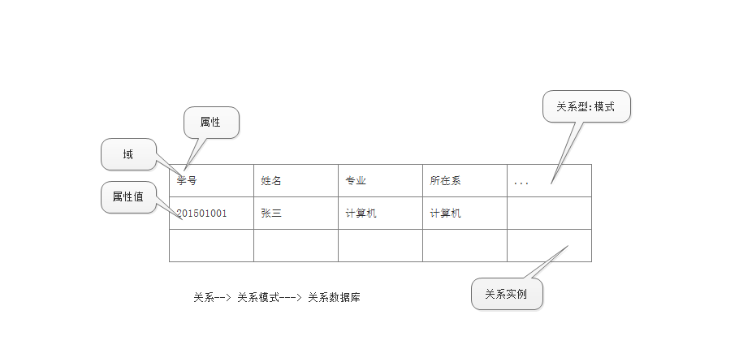

## 第二章 关系数据库

> 1. 关系模型 
>    1. 关系数据结构
>    2. 关系完整性约束
> 2. 关系代数
>    1. 传统集合操作
>    2. 关系特有操作
>    3. 综合例子
> 3. 关系验算

### 1.1关系数据结构

> #### 单一的数据结构--关系(表)
>
> * 现实世界的实体以及实体之间的各种联系都可以用**关系** 来表示
> * example:
> * 
>
> #### 域: 是具有相同数据类型的值的集合
>
> * 整数
> * 实数
> * 字符串
> * ....
>
> 域可以表示为笛卡尔积空间: 
>
> * 在数学中，两个集合X和Y的笛卡儿积（Cartesian product），又称直积，在集合论中表示为X × Y，是所有可能的有序对组成的集合，其中有序对的第一个对象是X的成员，第二个对象是Y的成员。
>   $$
>   {\displaystyle X\times Y=\left\{\left(x,y\right)\mid x\in X\land y\in Y\right\}}
>   $$
>
> * 在数据库域中,给定一定组域$ D_1,D_2...,D_n$ 允许其中的某些域是相同的.他们的笛卡尔积空间为
>   $$
>   D_1,D_2...,D_n = \{ (d_1,d_2,...,d_n) | d_i \in D_i, i =1,2,...n \}
>   $$
>   所有域取值的任意组合,笛卡尔积可以看做是 **关系** 的域
>
> * 基数:若$D_i (i=1,2,3...,n)$ 为有限集,其基数为$m_i(i=1,2,...,n)$ ,则$D_1,D_2,...,D_n $ 的基数$M$ 为
>   $$
>   M =     \prod_{i = I}^n m_i
>   $$
>
> * 笛卡尔积的表示方法
>
>   * 笛卡尔积可以表示为一张二维表
>   * 表中的每一行对一个元组,表中的每列对应一个域
>
> * 例如:假设A={a,b}，集合B={0,1,2}，则两个集合的笛卡尔积为{(a,0),(a,1),(a,2),(b,0),(b,1), (b,2)}
>
>   给出3个域:
>
>   D1 = 导师集合SUPERVISOR = {张一,刘二}
>
>   D2 = 专业集合SPECIALITY = {计算机专业,信息专业}
>
>   D3 = 研究生集合POSTGRADUATE = {李一,刘三,王一}
>
>   其笛卡尔积为 $D_1 \times D_2 \times D3$ = 2 * 2 * 3 = 12 
>
>   ```mysql
>   CREATE DATABASE test;
>
>   create table test.db;
>
>   create table SUPERVISOR (id int(11) PRIMARY KEY, name char(50));
>   INSERT into SUPERVISOR (id ,name) VALUE (1, "张一");
>   INSERT INTO SUPERVISOR (id, name ) VALUE (2,"刘二");
>
>   create table SPECIALITY (id int (11) PRIMARY KEY, position char(50) );
>   insert into SPECIALITY (id, position) VALUE (1, "计算机专业");
>   insert into SPECIALITY(id ,position) VALUE(2,"信息专业");
>
>   create table POSTGRADUATE ( id int(11) PRIMARY KEY, name CHAR(50));
>   insert into POSTGRADUATE (id, name ) VALUE(1,"李一");
>   insert into POSTGRADUATE (id, name ) VALUE (2, "刘三");
>   insert into POSTGRADUATE (id, name ) VALUE (3, "王一");
>   ```
>
>   ```mysql
>   select * from SUPERVISOR;
>   ```
>
>   
>
>   ```mysql
>   select * from SPECIALITY;
>   ```
>
>     
>
>   ```mysql
>   select * from POSTGRADUATE;
>   ```
>
>   
>   笛卡尔积为:
>
>   ```mysql
>   select * 
>   	from  SUPERVISOR
>   	CROSS JOIN 
>   		SPECIALITY
>   	CROSS JOIN 
>   		POSTGRADUATE;
>   ```
>
>   
>
>   ​
>
> #### 1.关系
>
> * 1.关系
>
>   $D_1 \times D_2 \times ...\times D_n$ 的子集叫做域 $D_1,D_2,...,D_n$ 上的关系,表示为 $R(D_1,D_2,,,D_n)$ ,R为关系名,n 为关系的目或度(Degree)
>
> * 2.元组
>
>   关系中的每个元素($d_1,d_2,,,d_n$) 叫做一个 n 元组(`n-tuple`) ,通常用`t` 来表示
>
> * 3.属性
>
>   关系中不同列称为**属性** (Attribute) 每个属性有一个名字, n 目关系,必有 n 个属性
>
> * 4.码
>
>   * 候选码:若关系中的某一属性组能唯一标识一个元组,则称为该属性组为候选码,简单的情况,候选码只有一个属性
>   * 全码:最极端的情况,关系模式中的所有属性组都是这个关系模式的候选码,称为全码
>   * 主码: 若一个关系有多个候选码,则选定其中一个作为主码(`Primary Key`)
>   * 主属性: 候选码的属性称为主属性(`Primary Attribute` ) ,不包含在任何候选码中的属性被称为非主属性(`Non-Prima Attribute`)
>
> * 5.简单关系和二元关系
>
>   * n = 1 ,一元关系
>   * n = 2 , 二元关系
>
> * 6.基本关系的性质
>
>   * 列是同质的,即来自于同一个属性
>   * 不同的列可以出自同一个域
>   * 列的顺序无所谓,列的次序可以任意交换
>   * 任意两个元组的候选码不能相同
>   * 行的顺序无所谓,行的次序可以任意交换
>   * 分量 必须取 原子值
>
> * 笛卡尔积的子集才有实际意义

### 1.2 关系模式

> 1.什么是关系模式
>
> * 关系模式是型,关系是值
> * 关系模式是对关系的描述,: 
>   * 元组集合的结构: 属性构成,属性来自的域,属性与域之间的映像关系
>   * 完整性约束条件
>
> 2.如何定义关系模式
>
>  * 关系模式可以形式的表示为:  `R(U,D , DOM ,F)` 
>     * R 关系名
>     * U 组成该关系的属性名的集合
>     * D U中属性所来自的域
>     * DOM 属性向域的映射集合
>     * F  属性间数据的依赖关系的集合
>
> 3.关系模式和关系的关系
>
> * 型与值得关系
>   * 关系模式: 是对关系的描述,是静态的,稳定的
>   * 关系: 是关系模式在某一个时刻的状态或内容,是动态的,是随着时间的变化而变化的

### 1.3关系数据库

> 关系数据库
>
> * 在一个给定的引用领域中,所有关系的集合构成了一个关系数据库
>
> 关系数据库的型和值
>
> * 关系数据库的型; 关系数据库模式,是对关系数据库的描述
> * 关系数据库的值: 关系模式在某一个时刻对应的关系的集合,通常称为关系数据库

## 关系的三类完整性约束

> 实体完整性和参照完整性
>
> * 关系模型必须满足的完整性约束条件称为关系的两个不变性,应该由关系系统自动支持
>
> 用户定义的完整性
>
> * 应用领域需要遵守的约束条件,提利息按了具体领域中的语意约束

### 1.实体完整性

> 实体完整性(Entity Intergrity)
>
> * 关系的主键不能取空值
> * 空值就是不知道或者不存在或者无意义的值
>
> 说明:
>
> * （1）实体完整性规则是针对基本关系而言的。一个基本表通常对应现实世界的一个实体集。
> * （2）现实世界中的实体是可区分的，即它们具有某种唯一性标识。
> * （3）关系模型中以主码作为唯一性标识。
> * （4）主码中的属性即主属性不能取空值。主属性取空值，就说明存在某个不可标识的实体，即存在不可区分的实体，这与第（2）点相矛盾，因此这个规则称为实体完整性

### 2.参照完整性

> #### 1. 关系内和关系间的引用
>
> 在关系模型中,实体与实体之间的联系都是用关系来描述的,自然存在着关系与关系间的引用.
>
> 1对1 
>
> ```mysql
> create table 学生 (学号, 姓名, 性别, 专业号, 年龄)
> create table 专业( 专业号, 专业名)
> /*学生关系引用了专业关系的专业号,学生关系中的关系值必须是趋势存在的专业的专业号 */
> ```
>
> 多对多
>
> ```mysql 
> create  table 学生( 学号, 姓名, 性别, 专业号, 年龄)
> create  table 课程( 课程号, 课程名,  学分)
> create  table  选修( 学号, 课程号, 成绩)
> ```
>
> 关系内1 对多 引用
>
> ```mysql
> create table  学生( 学号, 姓名, 性别,  专业号, 年龄,  班长)
> /* 学号是主码, 班长是 外码, 它引用了本关系的 学号, 班长必须是确实存在的学生的学号 */
> ```
>
> #### 2.外键 (Foreign key)
>
> * 设F 是基本关系 R 的一个或一组属性,但不是关系 R 的码,如果Ｆ与基本关系Ｓ的主键$K_s$ 相对应,则称F是R的外码
>
> * 基本关系R称为参照关系
>
> * 基本关系S称为被参照关系,或者目标关系
>
> * 他们之间的关系如图
>
>   
>   
>
>
> 关系R和S不一定是不同的关系
>
> 目标关系S的主码$K_s$ 和参照关系的外码 F 必须定义在同一个或一组 域上
>
> 外码并不一定要与相应的主要同名: 当外码与相应的主码属于不同关系时,往往取相同的名字,以便于识别
>
> #### 3 .参照完整性规则
>
> 若属性(或属性组)F 是基本关系R 的外码,它与基本关系S的主码$K_s$ 相对应,(基本关系R和S 不一定是不同的关系) 则对于R中每个元组在F上的值必须为:
>
> * 取空值(F的每个属性值均为空值)
> * 等于S中某个元组的主码值
>

### 3.用户自定义的完整性

> 针对某一具体关系数据库的约束条件,反映某一个具体应用所涉及的数据必须满足的语意要求
>
> 关系模型应提供定义和检验这类完整性的机制，以便用统一的系统的方法处理它们，而不需由应用程序承担这一功能

