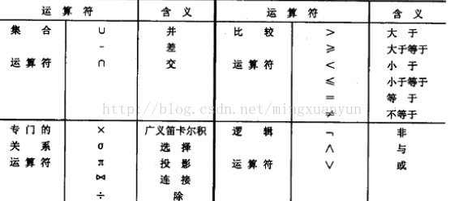
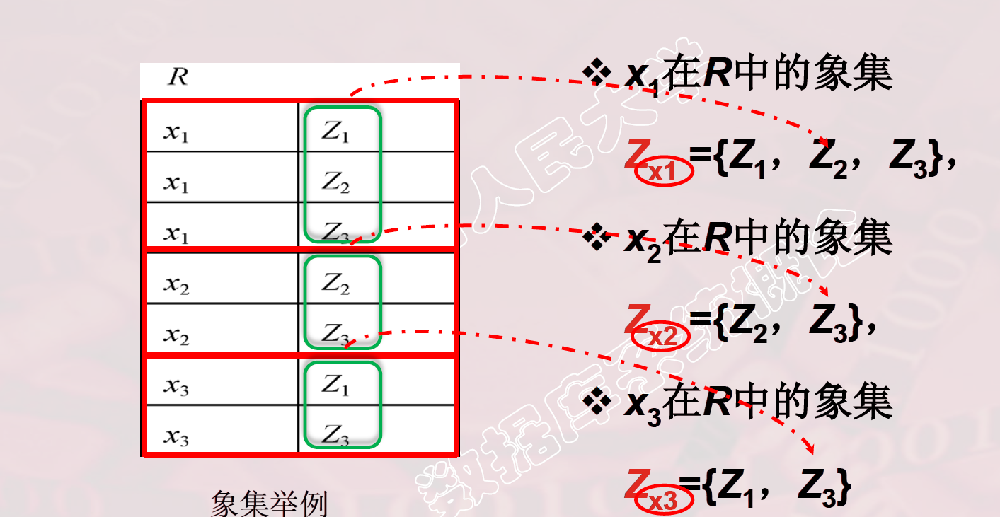

## 关系代数

> 关系代数语言:
>
> * 关系代数是以关系为运算的一组高级运算的集合。由于定义为属性个数 相同的元组的集合，因此集合代数的操作就可以引入到关系代数中。关系代数也可以看做是一种抽象的查询语言，是对关系的运算来表达查询的。任何一种运算都是将一定的运算符作用于一定的运算对象上，得到预期的运算结果。所以运算对象、运算符、运算结果是运算的三大要素。 
> * 关系代数的运算对象是关系
> * 运算结果亦为关系
> * 关系代数用到的运算符包括四类:集合运算符、专门的关系运算符、算术比较符和逻辑运算符
> * 
> * ​

### 1.传统的集合运算符

> 传统的集合操作：并、差、交、笛卡尔积（乘）、笛卡尔积的逆运算（除法）
>
> 一些符号

#### (1)  $R, t \in R , t[A_i]$

> 设关系模式为 $R(A_1,A_2,....,A_n$ 
>
> | 关系   | 元组                         | 属性                       | 分量                                       |
> | ---- | -------------------------- | ------------------------ | ---------------------------------------- |
> | $R$  | $ t\in R$ <br/> 表示t是R的一个元组 | $A_1,...A_n$<br/>是关系R的属性 | $t[A_i]$ <br/>表示元组 t中相对应属性$A_i$ <br/> 的一个分量 |

#### (2) $A, t[A] , \bar{A}$ 

> 若 $A = \{A_{i1} ,A_{i2}....,A_{ik}\}$  其中$A_{i1} ,A_{i2}....,A_{ik}$ 是$A_1,A_2,..A_n$ 一部分,则称A为属性组
>
> $t[A] = (t[A_{I1},,,t[A_{IK}]])$ 表示元组t在属性A上分量的集合
>
> $\bar{A}$ 表示$A = \{A_{i1} ,A_{i2}....,A_{ik}\}$  去掉$t[A] = (t[A_{I1},,,t[A_{IK}]])$ 后剩余的属性组

#### (3) $\widehat{t_r t_s}$ 

> R为n关系,S为m目关系
>
> $t_r \in R$ ,$ t_s \in S$ 则$\widehat{t_r t_s}$ 为元组的连接
>
> $\widehat{t_r t_s}$ 是一个 m+n 列的元组,前n 个分量 为 R中的一个n元组,后m个分量为S中的一个m元组

#### (4) 象集 $Z_x$

> 给定一个关系 $R(X, Z)$ ,$X,Z$ 为属性组
>
> 当$t[X] = x$ 时,x 在R中的象集(Images Set)为
> $$
> Z_X = \{  t[Z]  | t\in R, t[X] = x\}
> $$
> 它表示R中属性组X上的值为 x 的诸元组在Z上的分量的集合.
>
> 象集：本质上是一次选择行的运算和一次选择列的运算
> **求x1在表A中的象集，就是先选出所有x属性中x=x1的那些行，在这基础上选择出不包含x1的那些列**
>
> 

#### **1.并 （Union）**

> 关系R和S具有相同的关系模式，R和S的并是由属性R和S的元组构成的集合。 
>
> 形式定义如下： 
>
> *  **R∪S={t|t∈R∨ t∈S} , t 是元组变量，R和S的元素相同 **
>
>
> * 其结果由R和S的元素组成 

#### 2.**差 （Difference）**

> 关系R和S具有相同的关系模式，R和S的差由属于R但不属于S的元组构成的集合
>
> 形式定义如下： 
>
> - **R-S={t|t∈R ∧ t￠S)  t 是元组变量，R和S的元素相同**
> - 其结果由属于R不属于S的所有元组构成

#### 3.**笛卡尔积**(**Cartesian Product**)

> 广义笛卡尔积是一个(r+s)列的元组的集合。
>
> 形式定义如下：
>
> - 
>
>
> 

#### **4.交（Intersection）**

> 由属于R和S的元组构成的集合。记作：
>
> - **R∩S={t|t∈R∧t∈S}***
> - 由于R∩S=R(R-S)，或R∩S=S-S(S-R) 得到的，因此交操作不是一个独立的操作。 

### 代码实现

> ```mysql
> show databases;
> use testdb;
>
> CREATE TABLE Rdb (A varchar(10),B VARCHAR(10) ,C VARCHAR(10) );
> INSERT INTO Rdb (A,B,C) VALUES('a1','b1','c1');
> INSERT INTO Rdb (A,B,C) VALUES('a1','b2','c2');
> INSERT INTO Rdb (A,B,C) VALUES('a2','b2','c1');
>
> CREATE TABLE Sdb (A varchar(10),B VARCHAR(10) ,C VARCHAR(10) );
> INSERT INTO Sdb (A,B,C) VALUES('a1','b2','c2');
> INSERT INTO Sdb (A,B,C) VALUES('a1','b3','c2');
> INSERT INTO Sdb (A,B,C) VALUES('a2','b2','c1');
> ```
>
> ```mysql
> mysql> select * from Rdb;
> +------+------+------+
> | A    | B    | C    |
> +------+------+------+
> | a1   | b1   | c1   |
> | a1   | b1   | c1   |
> | a2   | b2   | c1   |
> +------+------+------+
> 3 rows in set (0.00 sec)
>
> mysql> select * from Sdb;
> +------+------+------+
> | A    | B    | C    |
> +------+------+------+
> | a1   | b2   | c2   |
> | a1   | b3   | c2   |
> | a2   | b2   | c1   |
> +------+------+------+
> 3 rows in set (0.00 sec)
> ```

#### 并集

> ```mysql
> mysql> select * from Rdb union all select * from Sdb;
> +------+------+------+
> | A    | B    | C    |
> +------+------+------+
> | a1   | b1   | c1   |
> | a1   | b1   | c1   |
> | a2   | b2   | c1   |
> | a1   | b2   | c2   |
> | a1   | b3   | c2   |
> | a2   | b2   | c1   |
> +------+------+------+
> 6 rows in set (0.00 sec)
> ```

#### 交集

> ```mysql
> mysql> select object.A ,object.B,object.C from Rdb object INNER JOIN Sdb object1 USING(A,B,C);
> +------+------+------+
> | A    | B    | C    |
> +------+------+------+
> | a2   | b2   | c1   |
> +------+------+------+
> 1 row in set (0.00 sec)
> ```

#### 差集

> ```mysql
> mysql> select * from Rdb union select * from Sdb;
> +------+------+------+
> | A    | B    | C    |
> +------+------+------+
> | a1   | b1   | c1   |
> | a2   | b2   | c1   |
> | a1   | b2   | c2   |
> | a1   | b3   | c2   |
> +------+------+------+
> 4 rows in set (0.00 sec)
> ```

#### 笛卡尔积

> ```mysql
> mysql> select * from Rdb cross join  Sdb;
> +------+------+------+------+------+------+
> | A    | B    | C    | A    | B    | C    |
> +------+------+------+------+------+------+
> | a1   | b1   | c1   | a1   | b2   | c2   |
> | a1   | b1   | c1   | a1   | b2   | c2   |
> | a2   | b2   | c1   | a1   | b2   | c2   |
> | a1   | b1   | c1   | a1   | b3   | c2   |
> | a1   | b1   | c1   | a1   | b3   | c2   |
> | a2   | b2   | c1   | a1   | b3   | c2   |
> | a1   | b1   | c1   | a2   | b2   | c1   |
> | a1   | b1   | c1   | a2   | b2   | c1   |
> | a2   | b2   | c1   | a2   | b2   | c1   |
> +------+------+------+------+------+------+
> 9 rows in set (0.00 sec)
> ```

[参考](http://blog.csdn.net/sanzhongguren/article/details/76615464)