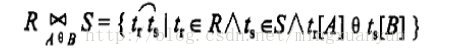
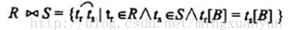

## 关系代数(专门的集合运算)

> ```mysql
> SHOW DATABASES;
> USE testdb;
> CREATE TABLE Student (
> Snu INT ( 3 ),
> Sname VARCHAR ( 10 ),
> Ssex VARCHAR ( 10 ),
> Sage INT ( 3 ),
> Sdept VARCHAR ( 10 ) 
> );
>
> INSERT INTO Student ( Snu, Sname, Ssex, Sage, Sdept )
> VALUES
> 	( 21, '李勇', "男", 20, "CS" ),
> 	( 22, "李晨", "女", 19, "CS" ),
> 	( 23, "王敏", "女", 18, "MA" ),
> 	( 25, "张力", "男", 19, "IS" );
>
> CREATE TABLE Course ( Cno INT ( 3 ), Cname VARCHAR ( 10 ), Cpno int(5), Ccredit INT ( 5 ) );
>
> INSERT INTO Course ( Cno, Cname, Cpno, Ccredit )
> VALUES
> 	( 1, "数据库", 5, 4 ),
> 	( 2, "数学", Null, 2 ),
> 	( 3, "信息系统", 1, 4 ),
> 	( 4, "操作系统", 6, 3 ),
> 	( 5, "数据结构", 7, 4 ),
> 	( 6, "数据处理", NULL, 2 ),
> 	( 7, "PASCAL语言", 6, 4 );
>
>
>
> CREATE TABLE SC ( Sno INT ( 3 ), Cno INT ( 3 ), Grade INT ( 5 ) );
> INSERT INTO SC ( Sno, Cno, Grade )
> VALUES
> 	( 21, 1, 92 ),
> 	( 21, 2, 85 ),
> 	( 21, 3, 88 ),
> 	( 22, 2, 90 ),
> 	( 22, 3, 80 );
> ```
>
> 有三张表:学生表(student),课程表(course),选修表(sc)
>
> ```mysql
> mysql> select * from student;
> +------+--------+------+------+-------+
> | Snu  | Sname  | Ssex | Sage | Sdept |
> +------+--------+------+------+-------+
> |   21 | 李勇   | 男   |   20 | CS    |
> |   22 | 李晨   | 女   |   19 | CS    |
> |   23 | 王敏   | 女   |   18 | MA    |
> |   25 | 张力   | 男   |   19 | IS    |
> +------+--------+------+------+-------+
> 4 rows in set (0.00 sec)
>
> mysql> select * from course;
> +------+--------------+------+---------+
> | Cno  | Cname        | Cpno | Ccredit |
> +------+--------------+------+---------+
> |    1 | 数据库       |    5 |       4 |
> |    2 | 数学         | NULL |       2 |
> |    3 | 信息系统     |    1 |       4 |
> |    4 | 操作系统     |    6 |       3 |
> |    5 | 数据结构     |    7 |       4 |
> |    6 | 数据处理     | NULL |       2 |
> |    7 | PASCAL语言   |    6 |       4 |
> +------+--------------+------+---------+
> 7 rows in set (0.00 sec)
>
> mysql> select * from sc;
> +------+------+-------+
> | Sno  | Cno  | Grade |
> +------+------+-------+
> |   21 |    1 |    92 |
> |   21 |    2 |    85 |
> |   21 |    3 |    88 |
> |   22 |    2 |    90 |
> |   22 |    3 |    80 |
> +------+------+-------+
> 5 rows in set (0.00 sec)
> ```

### 1. 选择(**Selection**)

> 选择运算符的含义:根据某些条件对关系做水平分割，即选取符合条件的元组。 
>
> ​       **σF(R) = {t|t∈R ∧ F(t)=true}**
>
> - σ为选择元算符，F表示选择条件，它是一个逻辑表达式，取逻辑值‘真’或‘假’
> - θ表示比较运算符，它可以是＞，≥，＜，≤，＝或<>
> - 选择运算从行的角度考虑的
>
> 例1: 查询信息系(IS)全体学生
>
>  $  σSdept= 'IS' (Student)$
>
> ```mysql
> mysql> select * from student where Sdept='IS';
> +------+--------+------+------+-------+
> | Snu  | Sname  | Ssex | Sage | Sdept |
> +------+--------+------+------+-------+
> |   25 | 张力   | 男   |   19 | IS    |
> +------+--------+------+------+-------+
> 1 row in set (0.00 sec)
> ```
>
> 例2: 查询年龄小于20的学生
>
> ```mysql
> mysql> select * from student where Sage < 20;
> +------+--------+------+------+-------+
> | Snu  | Sname  | Ssex | Sage | Sdept |
> +------+--------+------+------+-------+
> |   22 | 李晨   | 女   |   19 | CS    |
> |   23 | 王敏   | 女   |   18 | MA    |
> |   25 | 张力   | 男   |   19 | IS    |
> +------+--------+------+------+-------+
> 3 rows in set (0.00 sec)
> ```

### 2.投影(Projection)

> 对一个关系进行垂直分割，消去某些列，并重新安排列的顺序。记作：
>
> ​       **ΠA(R) = { t[A] | t∈R }**
>
> 其中A为R中的属性列,投影之后不仅取消了原关系这种的某些列,而且还可能取消某些元组(避免重复行)
>
> 例如:查询学生的姓名和所在系,即求Student关系上学生姓名和所在系两个属性上的投影
>
> ```mysql
> mysql> select Sname,Sdept from student;
> +--------+-------+
> | Sname  | Sdept |
> +--------+-------+
> | 李勇   | CS    |
> | 李晨   | CS    |
> | 王敏   | MA    |
> | 张力   | IS    |
> +--------+-------+
> 4 rows in set (0.00 sec)
> ```
>
> 查询学生关系Student中都有哪些系
>
> ```mysql
> mysql> select Sdept from student;
> +-------+
> | Sdept |
> +-------+
> | CS    |
> | CS    |
> | MA    |
> | IS    |
> +-------+
> ```

### 3.连接

> 连接也称为θ连接
>
> 
>
> * A和B : 分别是R和S上度数相等且可比的属性组
> * θ : 比较运算符
> * 连接运算从R和S的广义笛卡尔积R×S中选取R关系在A属性组上的值与S关系在B属性组上的值满足比较关系θ的元组
>
> 两类常用的链接运算
>
> * 等值连接(equijoin)
>   * θ为“＝”的连接运算称为等值连接
>   * 从关系R与S的广义笛卡尔积中选取A、B属性值相等的那些元组
> * **自然连接（Natural join）**：
>   * 自然连接用R连接R ⋈ S表示，是一种特殊的等值连接，一般使用在R和S中有公共属性的情况中。例如，R和S中有相同的属性B记作：
>   *     
>
> * 一般的连接操作是从行的角度进行运算,自然连接还需要取消重复列，所以是同时从行和列的角度进行运算。
>
> 例如有如下表格:
>
> ```mysql
> CREATE TABLE R1 ( A VARCHAR ( 10 ), B VARCHAR ( 10 ), C INT ( 3 ) );
> INSERT INTO R1 ( A, B, C )
> VALUES
> 	( "a1", "b1", 5 ),
> 	( "a1", "b2", 6 ),
> 	( "a2", "b3", 8 ),
> 	( "a2", "b4", 12 );
> CREATE TABLE S1 ( B VARCHAR ( 10 ), E INT ( 3 ) );
> INSERT INTO S1 ( B, E )
> VALUES
> 	( "b1", 3 ),
> 	( "b2", 7 ),
> 	( "b3", 10 ),
> 	( "b3", 2 ),
> 	( "b2", 2 )
> ```
>
> ```mysql
> mysql> select * from r1;
> +------+------+------+
> | A    | B    | C    |
> +------+------+------+
> | a1   | b1   |    5 |
> | a1   | b2   |    6 |
> | a2   | b3   |    8 |
> | a2   | b4   |   12 |
> +------+------+------+
> 4 rows in set (0.00 sec)
>
> mysql> select * from s1;
> +------+------+
> | B    | E    |
> +------+------+
> | b1   |    3 |
> | b2   |    7 |
> | b3   |   10 |
> | b3   |    2 |
> | b2   |    2 |
> +------+------+
> 5 rows in set (0.01 sec)
> ```

#### 等值连接

> ```mysql
> mysql> select * from R1 INNER JOIN S1 ON R1.B = S1.B;
> +------+------+------+------+------+
> | A    | B    | C    | B    | E    |
> +------+------+------+------+------+
> | a1   | b1   |    5 | b1   |    3 |
> | a1   | b2   |    6 | b2   |    7 |
> | a2   | b3   |    8 | b3   |   10 |
> | a2   | b3   |    8 | b3   |    2 |
> | a1   | b2   |    6 | b2   |    2 |
> +------+------+------+------+------+
> 5 rows in set (0.01 sec)
> ```

#### 自然连接

> ```mysql
> mysql> select * from R1 NATURAL JOIN S1;
> +------+------+------+------+
> | B    | A    | C    | E    |
> +------+------+------+------+
> | b1   | a1   |    5 |    3 |
> | b2   | a1   |    6 |    7 |
> | b3   | a2   |    8 |   10 |
> | b3   | a2   |    8 |    2 |
> | b2   | a1   |    6 |    2 |
> +------+------+------+------+
> 5 rows in set (0.01 sec)
> ```

#### 悬浮元组(Dangling tuple)

> 两个关系R和S在做自然连接时，关系R中某些元组有可能在S中不存在公共属性上值相等的元组，从而造成R中这些元组在操作时被舍弃了，这些被舍弃的元组称为悬浮元组。

#### 外链接(Outer Join)

> 如果把悬浮元组也保存在结果关系中，而在其他属性上填空值(Null)，就叫做外连接
>
> - 左外连接(LEFT OUTER JOIN或LEFT JOIN)
>   - 只保留左边关系R中的悬浮元组
> - 右外连接(RIGHT OUTER JOIN或RIGHT JOIN)
>   - 只保留右边关系S中的悬浮元组
>
> ```mysql
> mysql> select * from R1 left join S1 on R1.B = S1.B;
> +------+------+------+------+------+
> | A    | B    | C    | B    | E    |
> +------+------+------+------+------+
> | a1   | b1   |    5 | b1   |    3 |
> | a1   | b2   |    6 | b2   |    7 |
> | a2   | b3   |    8 | b3   |   10 |
> | a2   | b3   |    8 | b3   |    2 |
> | a1   | b2   |    6 | b2   |    2 |
> | a2   | b4   |   12 | NULL | NULL |
> +------+------+------+------+------+
> 6 rows in set (0.01 sec)
>
> mysql> select * from R1 right join S1 on R1.B = S1.B;
> +------+------+------+------+------+
> | A    | B    | C    | B    | E    |
> +------+------+------+------+------+
> | a1   | b1   |    5 | b1   |    3 |
> | a1   | b2   |    6 | b2   |    7 |
> | a1   | b2   |    6 | b2   |    2 |
> | a2   | b3   |    8 | b3   |   10 |
> | a2   | b3   |    8 | b3   |    2 |
> +------+------+------+------+------+
> 5 rows in set (0.02 sec)
> ```

### 4.除运算

> 给定关系R(X,Y)和S(Y,Z),其中X,Y,Z为属性组。R中Y与S中的Y可以有不同的属性名,但必须出自相同的域集。R与S的除运算可以得到一个新的关系P(X),P是R中满足下列条件的元组在X 属性列上的投影: 元组在X上的分量值x的像集Y(x)包含S在Y上的投影的集合
>
> * R÷S={tr[X]|tr∈R∧πY(S)⊆Yx}
> * Yx：x在R中的象集，x = tr[X]
>
>
> 求解步骤过程：
>
> - 第一步：找出关系R和关系S中相同的属性，即Y属性。在关系S中对Y做投影（即将Y列取出）；
> - 第二步：被除关系R中与S中不相同的属性列是X，关系R在属性X上做取消重复值的投影；
> - 第三步：求关系R中X属性对应的像集Y；
> - 第四步：判断包含关系，R÷S其实就是判断关系R中X各个值的像集Y是否包含关系S中属性Y的所有值。
>
> ```mysql
> select distinct R.X from R R1
> where not exists
> ( 
>     select S.Y from S
>     where not exists
>     ( 
>         select * from R R2
>         where R2.X=R1.X and R2.Y=S.Y 
>     ) 
> )
> ```
>
> 