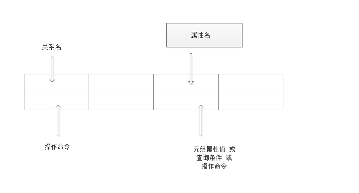

## 关系演算(域关系演算语言QBE)

> 一种典型的域关系演算语言
>
> * 以元组变量的分量即域变量作为谓词变元的基本对象
>
>
> * 1978年在IBM370上得以实现
>
>
> * QBE也指此关系数据库管理系统
>
> QBE：Query By Example
>
> * 基于屏幕表格的查询语言
> * 查询要求：以填写表格的方式构造查询
> * 用示例元素(域变量)来表示查询结果可能的情况
> * 查询结果：以表格形式显示

### QBE操作框架

> 

### 简单查询

> 1.简单查询
> [例1]求信息系全体学生的姓名
> 操作步骤为：
>
> （1）用户提出要求；
>
> （2）屏幕显示空白表格；
>
> |      |      |      |      |
> | ---- | ---- | ---- | ---- |
> |      |      |      |      |
>
> （3）用户在最左边一栏输入要查询的关系名Student
>
> | Student |      |      |      |      |      |
> | ------- | ---- | ---- | ---- | ---- | ---- |
> |         |      |      |      |      |      |
>
> （4）系统显示该关系的属性名
>
> | Student | Sno  | Sname | Ssex | Sage | Sdept |
> | ------- | ---- | ----- | ---- | ---- | ----- |
> |         |      |       |      |      |       |
>
> （5）用户在上面构造查询要求
>
> | Student | Sno  | Sname              | Ssex | Sage | Sdept |
> | ------- | ---- | ------------------ | ---- | ---- | ----- |
> |         |      | $P.\underline{T} $ |      |      |       |
>
> $P.\underline{T} $ 是示例元素,即域变量
>
> （6）屏幕显示查询结果
>
> | Student | Sno  | Sname | Ssex | Sage | Sdept |
> | ------- | ---- | ----- | ---- | ---- | ----- |
> |         |      | 李勇 张立 |      |      | IS    |
>
> 

