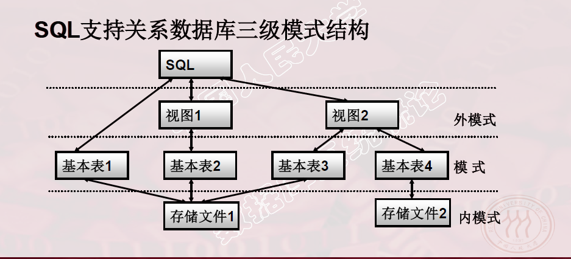

## SQL概述和定义

> SQL(Structured Query Language)
>
> 结构化查询语言,是数据库的标准语言

### SQL的特点

> 综合统一
>
> - 集数据定义语言（DDL），数据操纵语言（DML），数据控制语言（DCL）功能于一体。
>
>
> - 可以独立完成数据库生命周期中的全部活动：
>   - 定义和修改、删除关系模式，定义和删除视图，插入数据，建立数据库;
>   - 对数据库中的数据进行查询和更新;
>   - 数据库重构和维护
>   - 数据库安全性、完整性控制，以及事务控制
>   - 嵌入式SQL和动态SQL定义
>
> 高度非过程化
>
> - 非关系数据模型的数据操纵语言“面向过程”，必须指定存取路径。
> - SQL只要提出“做什么”，无须了解存取路径。
> - 存取路径的选择以及SQL的操作过程由系统自动完成。
>
> 面向集合的操作方式
>
> - 非关系数据模型采用面向记录的操作方式，操作对象是一条记录
> - SQL采用集合操作方式
> - 操作对象、查找结果可以是元组的集合
> - 一次插入、删除、更新操作的对象可以是元组的集合
>
> 以同一种语法结构提供多种使用方式
>
> - SQL是独立的语言,能够独立地用于联机交互的使用方式
> - SQL又是嵌入式语言, SQL能够嵌入到高级语言（例如C，C++，Java）程序中，供程序员设计程序时使用
>
> 语言简洁，易学易用
>
> - SQL功能极强，完成核心功能只用了9个动词。
>
> | SQL 功能 | 动词                        |
> | ------ | ------------------------- |
> | 数据查询   | SELECT                    |
> | 数据定义   | CREATE, DROP, ALTER       |
> | 数据操作   | INSERT , UPDATE , DELEATE |
> | 数据控制   | GRANT , REVOKE            |

### SQL 支持关系数据库的三级模式结构

> 

> 基本表
>
> - 本身独立存在的表
> - SQL中一个关系就对应一个基本表
> - 一个（或多个）基本表对应一个存储文件
> - 一个表可以带若干索引
>
> 存储文件
>
> - 逻辑结构组成了关系数据库的内模式
> - 物理结构对用户是隐蔽的
>
> 视图
>
> - 从一个或几个基本表导出的表
> - 数据库中只存放视图的定义而不存放视图对应的数据
> - 视图是一个虚表
> - 用户可以在视图上再定义视图
>
> 示例数据库
>
> - 学生-课程模式S-T :
>   - 学生表：`Student(Sno,Sname,Ssex,Sage,Sdept)`
>   - 课程表：`Course(Cno,Cname,Cpno,Ccredit)`
>   - 学生选课表：`SC(Sno,Cno,Grade)`
>
> ```mysql
> mysql root@10.115.28.13:testdb> select * from student;
> +-------+---------+--------+--------+---------+
> |   Snu | Sname   | Ssex   |   Sage | Sdept   |
> |-------+---------+--------+--------+---------|
> |    21 | 李勇    | 男     |     20 | CS      |
> |    22 | 李晨    | 女     |     19 | CS      |
> |    23 | 王敏    | 女     |     18 | MA      |
> |    25 | 张力    | 男     |     19 | IS      |
> +-------+---------+--------+--------+---------+
> 4 rows in set
> Time: 0.051s
> mysql root@10.115.28.13:testdb> select * from course;
> +-------+------------+--------+-----------+
> |   Cno | Cname      |   Cpno |   Ccredit |
> |-------+------------+--------+-----------|
> |     1 | 数据库     |      5 |         4 |
> |     2 | 数学       | <null> |         2 |
> |     3 | 信息系统   |      1 |         4 |
> |     4 | 操作系统   |      6 |         3 |
> |     5 | 数据结构   |      7 |         4 |
> |     6 | 数据处理   | <null> |         2 |
> |     7 | PASCAL语言 |      6 |         4 |
> +-------+------------+--------+-----------+
> 7 rows in set
> Time: 0.011s
> mysql root@10.115.28.13:testdb> select * from sc;
> +-------+-------+---------+
> |   Sno |   Cno |   Grade |
> |-------+-------+---------|
> |    21 |     1 |      92 |
> |    21 |     2 |      85 |
> |    21 |     3 |      88 |
> |    22 |     2 |      90 |
> |    22 |     3 |      80 |
> +-------+-------+---------+
> 5 rows in set
> Time: 0.021s
> ```

### 数据定义

> SQL 的数据定义功能: 定义各种数据库的"对象"
>
> - 模式定义
> - 表定义
> - 视图定义
> - 索引定义
>
> SQL 的数据定义语句
>
> | 操作对象 | 操作方式: 创建      | 操作方式:删除     | 操作方式: 修改    |
> | ---- | ------------- | ----------- | ----------- |
> | 模式   | CREATE SCHEME | DROP SCHEME |             |
> | 表    | CREATE TABLE  | DROP TABLE  | ALTER TABLE |
> | 视图   | CREATE VIEW   | DROP VIEW   |             |
> | 索引   | CREATE INDEX  | DROP INDEX  | ALTER INDEX |
>
> 现代关系数据库管理系统提供了一个层次化的数据库对象命名机制:
>
> - 一个数据库中可以创建多个模式
> - 一个模式下通常包括多个表,视图和索引等数据库对象
>
> 数据字典是关系数据库管理系统内部的一组系统表,它记录了数据库中所有对象的定义信息以及一些统计信息:
>
> * 关系模式,表,视图,索引的定义
> * 完整性约束的定义
> * 各类用户对数据库的操作权限
> * 统计信息等.
>
> 关系数据库管理系统在执行SQL的数据定义语句时,实际上就是跟新数据字典表中的相应信息.

#### 1.模式定义

> 为用户 wang 定义一个学生-课程模式S-T
>
> ```sql
> CREATE SCHEME "S-T" AUTHORIZATION WANG;
> /*该语句没有指定<模式名> , <模式名>隐含为<用户名>*/
> ```
>
> - 定义模式实际上是定义了一个` 命名空间(或者说是目录)`
>
> - 在这个空间中可以定义该模式包含的数据库对象,例如基本表,视图,索引等
>
> - 在`CRETAE SCHEME` 中可以接受`CREATE TABLE, CREATE VIEW, GRANT`子句.
>
>   - ```SQL
>     CREATE SCHEME<模式名> AUTHORIZATION <用户名>[<表定义子句>| <视图定义子句>| 授权子句]
>     ```
>
> - 为用户ZHANG 创建一个模式TEST,并在其中定义一个表TAB1
>
>   - ```sql
>     CREATE SCHEME TEST AUTHORIZATION ZHANG
>     CREATE TABLE TAB1(COL1 SMALLINT,
>                       COL2  INT,
>                       COL3 CHAR(20),
>                       COL4 DECIMAL(5,2)
>                      );
>     ```
>
> - `DEOP SCHEME <模式名> <CASCADE|RESTRICT>`
>
>   - `CASCADE(级联)` : 删除模式的同时把该模式中所有的数据库对象全部删除
>   - `RESTRICT(限制)`: 如果模式中定义了下属的数据库对象(表,视图等),则拒绝该删除语句的执行,仅当该模式中没有任何下属的对象时才能执行

#### 2.表定义

> 定义基本表
>
> ```SQL
> CREATE TABLE <表名>(
>   <列名> <数据类型>[<列级完整性约束条件>],
>   <列名> <数据类型>[<列级完整性约束条件>],
>   [<表级完整性约束条件>]
> );
> /*
> <列级完整性约束条件>: 涉及相应属性列的完整性约束条件
> <表级完整性约束条件>: 涉及一个或多个属性类的完整性约束条件
> 如果完整性约束条件涉及到该表的多个属性列上,则必须定义在表级上
> */
> ```
>
> 例1: 建立学生表Student,学号是主码,姓名取值唯一:
>
> ```SQL
> create table Student(
>   Sno char(9) primary key,    /* Sno 是主码: 列级*/
>   Sname char(20) unique,      /*Sname取值唯一:列级 */
>   Ssex char(2),
>   Sage smallint,
>   Sdept char(20)
> );
> ```
>
> 例2:建立课程表Course
>
> ```SQL
> create table Couse(
> Cno CHAR(4) PRIMARY KEY,
> Cname CHAR(40),
> Cpno CHAR(4),
> Ccredit SMALLINT，
> FOREIGN KEY (Cpno) REFERENCES Course(Cno) /*Cpno是外键,被参照表Course,被参照列是Cno*: 列级别/
> )
> ```
>
> 例3: 建一个学生选课表SC
>
> ```SQL
> CREATE TABLE SC(
>   Sno CHAR(9),
>   Cno CHAR(4),
>   Grade SMALLINT，
>   PRIMARY KEY (Sno,Cno),     /* 主码由两个属性构成，必须作为表级完整性进行定义*/
>   FOREIGN KEY (Sno) REFERENCES Student(Sno),/*表级完整性约束条件,Sno是外码,被参照表是Student */
>   FOREIGN KEY (Cno)REFERENCES Course(Cno) /* 表级完整性约束条件,Cno是外码,被参照表是Course*/
>   );
> ```
>
> - 关系模式中的"域" 概念是用数据类型来实现的
> - 定义表的属性时需要指明其数据类型及长度
> - 选用哪种数据类型
>   - 取值范围
>   - 要做哪些运算
>
> 数据类型表
>
> | 数据类型                            | 含义                               |
> | ------------------------------- | -------------------------------- |
> | CHAR(n),CHARACTER(n)            | 长度为n的定长字符串                       |
> | VARCHAR(n), CHARACTERVARYING(n) | 最大长度为n的变长字符串                     |
> | CLOB                            | 字符串大对象                           |
> | BLOB                            | 二进制大对象                           |
> | INT，INTEGER                     | 长整数（4字节）                         |
> | SMALLINT                        | 短整数（2字节）                         |
> | BIGINT                          | 大整数（8字节）                         |
> | NUMERIC(p，d)                    | 定点数，由p位数字（不包括符号、小数点）组成，小数后面有d位数字 |
> | DECIMAL(p, d), DEC(p, d)        | 同NUMERIC                         |
> | REAL                            | 取决于机器精度的单精度浮点数                   |
> | DOUBLE PRECISION                | 取决于机器精度的双精度浮点数                   |
> | FLOAT(n)                        | 可选精度的浮点数，精度至少为n位数字               |
> | BOOLEAN                         | 逻辑布尔量                            |
> | DATE                            | 日期，包含年、月、日，格式为YYYY-MM-DD         |
> | TIME                            | 时间，包含一日的时、分、秒，格式为HH:MM:SS        |
> | TIMESTAMP                       | 时间戳类型                            |
> | INTERVAL                        | 时间间隔类型                           |
>
> - 每一个基本表需属于摸个模式
>
> - 定义基本表所属模式的方式
>
>   - 方法1: 在表名中明显的给出模式名
>
>     ```SQL
>     create table "S-T".Student(...);
>     create table "S-T".Coure(...);
>     create table "S-T".SC(...);
>     ```
>
>   - 方法2:在创建模式的同时创建表
>
>   - 方法3:设置所属的模式
>
> - 创建基本表(其他数据库对象也一样)时,若没有指定模式,系统根据搜索路径来确定该对象所属于的模式
>
> - 关系数据库管理系统会以 搜索路径指向的模式作为数据库对象的模式名
>
> - 设置搜索路径的方式
>
> ```sql
> set search_path to "S-T", public;
> ```
>
> #### 修改基本表
>
> ```sql
> alter table <表名>
> [add [column]] <新列名> <数据类型> [完整性约束]
> [add <表级完整性约束>]
> [drop [column]] <列名> [CASCADE| RESTRICT]
> [drop constraint <完整性约束名> [restrict| cascade]]
> [alter column<列名><数据类型>];
> ```
>
> * <表名> 是要修改的表
> * add 子句用于增加新列, 新的列级完整性约束条件和新的表级别完整性约束条件
> * drop column子句用于删除表中的列
>   * 如果指定了cascade短语,则自动删除引用了该列的其他对象
>   * 如果指定了restrict ,则如果该列被其他对象引用,关系数据管理系统将拒绝删除该列
> * drop constraint 用于删除指定的完整性约束条件
> * alter column用于修改原有的列定义,包括修改列名和数据类型
>
>


#### 3.索引定义

> 建立索引的目的: 加快查询速度
>
> 关系数据库管理系统中常见索引
>
> - 顺序文件上的索引
> - B+ 树索引
> - 散列(hash) 索引
> - 位图索引
>
> 特点:
>
> - B+树索引具有动态平衡的有点,
> - HASH索引具有查找速度快的特点
>
> 关系数据库管理系统自动完成维护索引
>
> 关系数据库管理系统自动选择合适的索引作为存取路径,用户不必显式的选择索引
>
> 语句格式:
>
> ```SQL
> create [unique] [cluster] index <索引名>
> on <表名>(<列名>[<次序>][,<列名>[<次序>]]....)
> ```
>
> - 表名: 要建立索引的基本表的名字
> - 索引: 可以建议在该表的一列或多列上,个列名之间用逗号分隔
> - <次序>: 指定索引值得排列次序,升序:ASC , 降序 DESC,默认升序
> - unique: 这个索引的每一个索引值只对应唯一的数据记录
> - cluster: 表示要建立的宿营是聚簇索引
>
> 例1: 为学生-课程数据库中的Student,Course,SC三个表建立索引,Student表按学号升序建唯一索引,Course表按课程号升序建唯一索引,SC表按序号升序和课程号降序建唯一索引
>
> ```sql
> create unique index Stusno on Student(Sno);
> create unique index Coucno on Course(Cno);
> create unique index SCno on SC(sno ASC,Cno DESC )
> ```
>
> 修改索引
>
> ```sql
> alter index <旧索引名> rename to <新索引名>;
> ```
>
> 删除索引
>
> ```sql
> drop index <索引名>;
> ```
>
> 